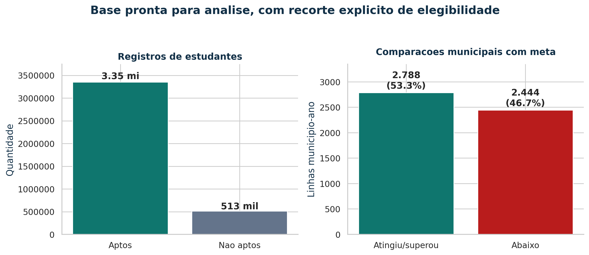
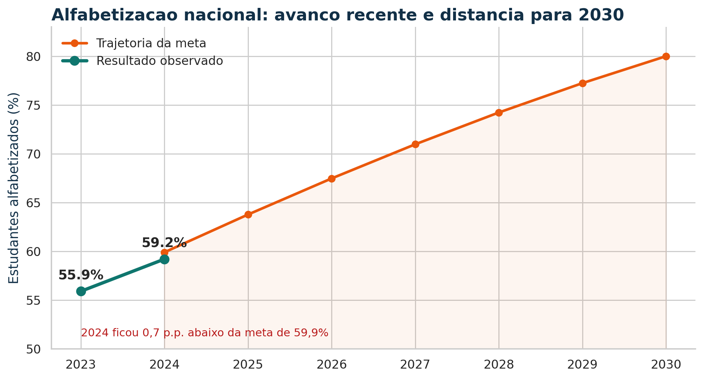
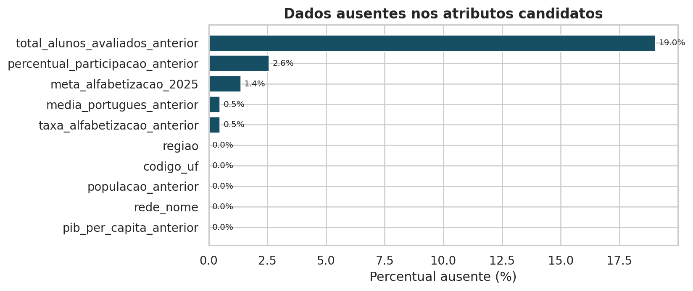
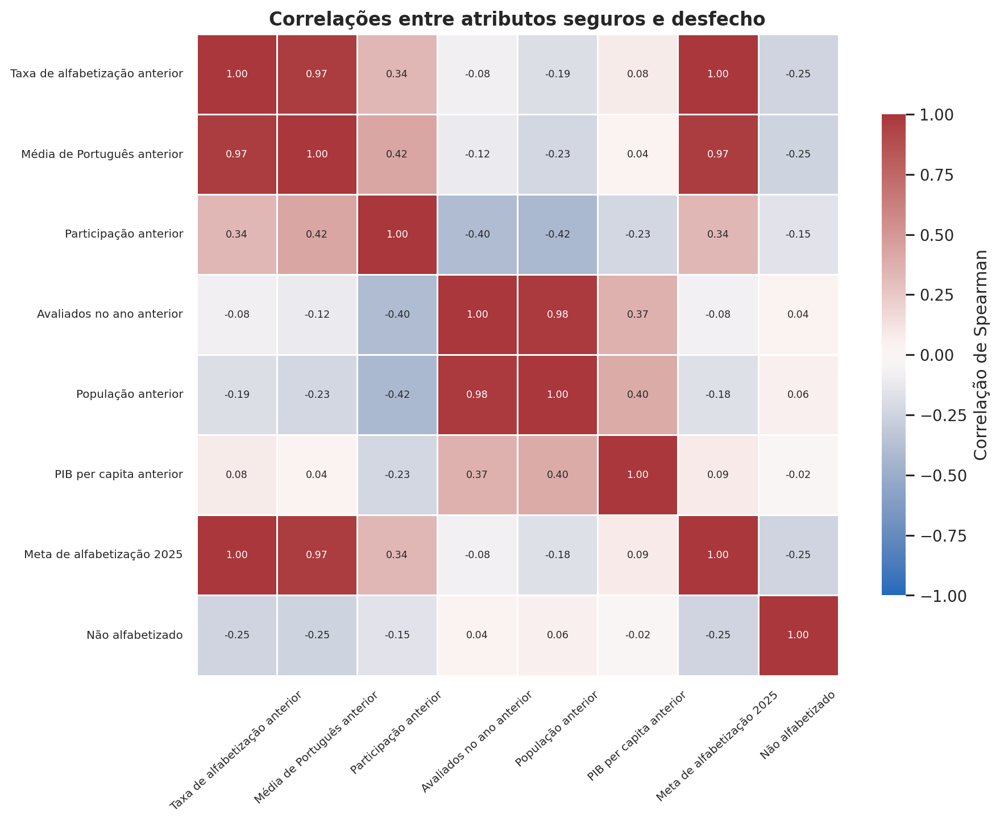
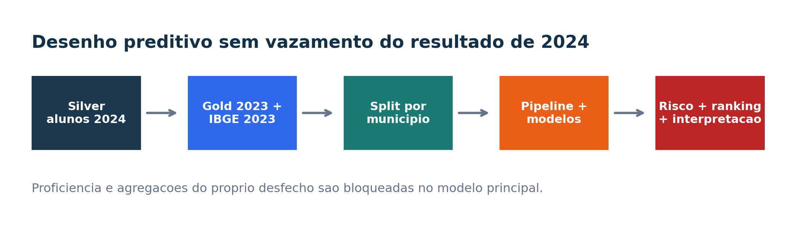
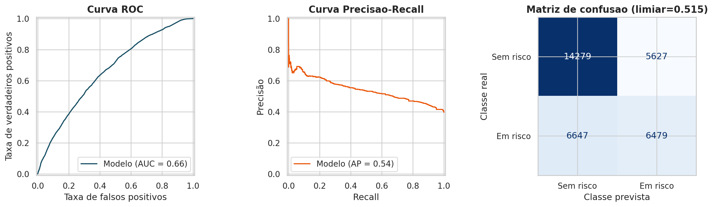
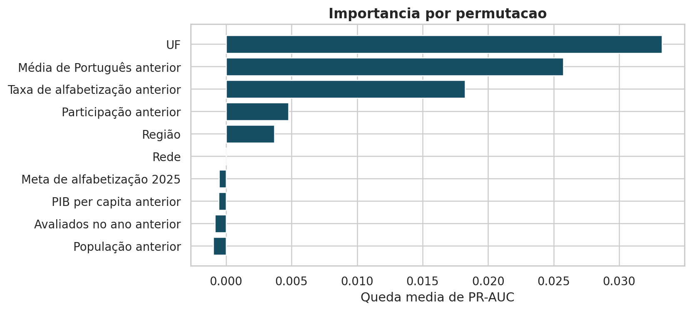
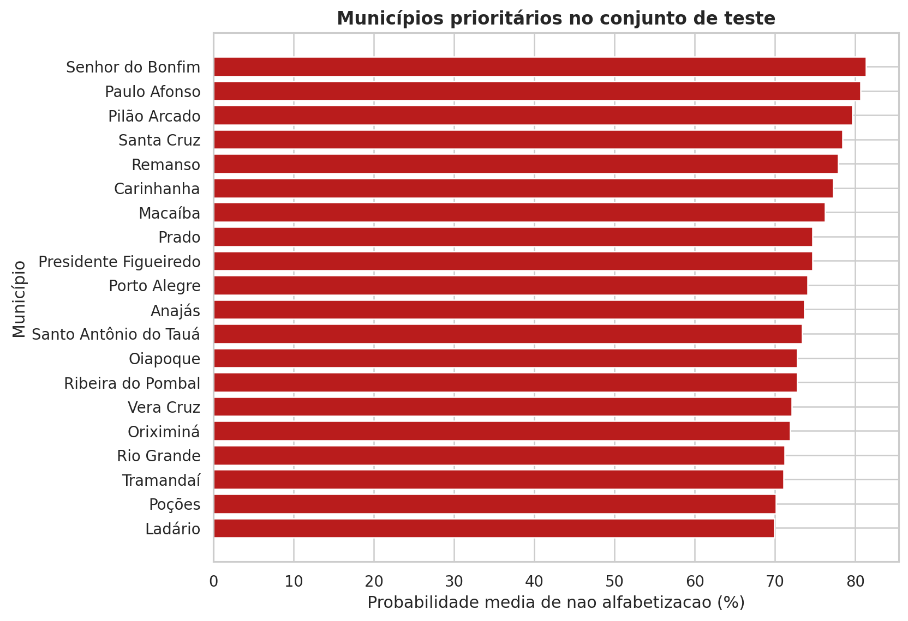

# Predicao e Inteligencia Analitica para Alfabetizacao no Brasil

**Tech Challenge - Fase 3**  
**Curso:** Pós-graduação em Inteligência Artificial  
**Equipe:** [preencher nomes e RM]  
**Data:** 9 de setembro de 2026

> Nota de integridade: todas as métricas preditivas deste relatório foram calculadas sobre a exportação real `ml_alfabetizacao.csv`, com 160.978 registros. A execução é rastreável pelo SHA-256 `b0898f45a637626f20b2dfb855c0a87f4ef75e4f3761366c38246c64d42c0570`. Nenhum resultado sintético foi incorporado.

## Resumo executivo

O objetivo deste trabalho é antecipar o risco de não alfabetização de estudantes do 2º ano do Ensino Fundamental e transformar as probabilidades individuais em inteligência territorial para priorização de municípios. A solução reutiliza a arquitetura Bronze, Silver e Gold da Fase 2, incorpora contexto educacional defasado e atributos socioeconômicos do IBGE, compara modelos supervisionados e produz um ranking municipal interpretável.

A principal decisão metodológica foi excluir do modelo acionável a proficiência e qualquer indicador agregado do próprio resultado de 2024. Como a classificação oficial de alfabetização é definida pela proficiência, utilizar essa variável produziria um atalho circular, com aparência de excelente desempenho mas sem utilidade antes da avaliação. O modelo principal utiliza apenas informações de 2023, características territoriais estáveis e a meta de 2025.

Na amostra real, a regressão logística regularizada foi o melhor candidato. No teste formado apenas por municípios não vistos, obteve ROC-AUC de 0,661 e PR-AUC de 0,542, frente a uma prevalência de risco de 0,397. Isso equivale a ganho absoluto de 0,145 e relativo de 36,5% sobre a referência aleatória da curva Precisão-Recall. O resultado indica capacidade moderada de ordenação territorial, não precisão suficiente para decisões individuais automáticas.

A auditoria herdada da Fase 2 registra 3.867.999 linhas de estudantes, das quais 513.338 não estavam aptas à análise de desempenho. Restaram aproximadamente 3,35 milhões de registros aptos. A taxa nacional observada avançou de 55,9% em 2023 para 59,2% em 2024, aumento de 3,3 pontos percentuais, mas ficou 0,7 ponto abaixo da meta de 59,9%. Entre 5.232 comparações município-ano com meta, 2.788 (53,3%) atingiram ou superaram a referência e 2.444 (46,7%) ficaram abaixo. Esse quadro justifica uma ferramenta de triagem antecipada e territorial.

## 1. Contexto e problema de negócio

O Indicador Criança Alfabetizada considera alfabetizado o estudante que atinge o padrão de desempenho definido para a avaliação nacional. Na base utilizada, o corte corresponde a 743 pontos na escala do Saeb. Embora o indicador observado seja indispensável para monitoramento, ele chega depois da aplicação da avaliação. Para uma política pública ser preventiva, é necessário estimar risco antes que o resultado corrente seja conhecido.

Este trabalho responde a cinco perguntas:

1. Quais fatores disponíveis antes da avaliação estão mais associados ao risco de não alfabetização?
2. Quais municípios devem ser priorizados para diagnóstico e apoio?
3. Quais municípios possuem perfis contextuais semelhantes?
4. Qual é a distância entre a alfabetização prevista e a meta de 2025?
5. Como transformar o modelo em um instrumento de apoio, sem automatizar decisões sensíveis?

O produto analítico não substitui avaliação pedagógica, visita técnica ou decisão humana. Seu papel é ordenar prioridades sob restrição de recursos.

## 2. Dados, escopo e proveniência

### 2.1 Origem

A fonte principal é a Avaliação da Alfabetização do Inep, disponibilizada em formato tratado pela Base dos Dados. A Fase 2 integrou as tabelas no projeto GCP `tech-alfabetizacao-vdemarchi`, com as camadas:

- `silver.alunos`, contendo registros por estudante;
- `gold.indicador_municipio`, contendo metas, resultados e auditorias municipais;
- `gold.indicador_uf`, `gold.indicador_brasil` e `gold.evolucao_alfabetizacao`, utilizadas no contexto agregado;
- `quality.resumo_validacao_final`, com regras de qualidade.

O enriquecimento usa as tabelas públicas de população e PIB municipal do IBGE mantidas pela Base dos Dados. Todas as variáveis de contexto foram limitadas a 2023 para prever o desfecho de 2024.

### 2.2 Recorte analítico

- População-alvo: estudantes da rede municipal, 2º ano do Ensino Fundamental, presentes, com prova preenchida e registro apto.
- Unidade de modelagem: estudante.
- Unidade de decisão: município.
- Período do desfecho: 2024.
- Classe positiva: `nao_alfabetizado = 1`.
- Chave de separação: `id_municipio`.

A opção pela rede municipal mantém coerência com as metas e resultados de `gold.indicador_municipio`, que foram construídos para `rede_codigo = 3` na Fase 2.

### 2.3 Proteção de dados

O identificador do aluno é utilizado dentro do BigQuery apenas para construir uma amostra determinística e não é exportado. O repositório ignora microdados, credenciais, modelos e predições individuais. Apenas resultados agregados podem ser publicados.

## 3. Análise exploratória e qualidade

### 3.1 Volume e elegibilidade

A Silver contém 3.867.999 registros de estudantes em 2023 e 2024. A regra `apto_analise_desempenho` exclui 513.338 registros relacionados principalmente a ausência ou prova não preenchida. O conjunto potencialmente elegível tem 3.354.661 registros, ou 86,7% do total.

Essa exclusão não deve ser interpretada como erro de engenharia. Entretanto, pode produzir viés de seleção se a ausência estiver relacionada ao próprio risco de não alfabetização. Por isso, participação anterior entra como atributo e o relatório recomenda monitoramento separado dos não participantes.

### 3.2 Evolução nacional e metas

O resultado nacional aumentou de 55,9% para 59,2% entre 2023 e 2024. O avanço de 3,3 pontos percentuais não foi suficiente para alcançar a meta de 2024, de 59,9%. A trajetória registrada na fonte chega a 80% em 2030.

O ganho nacional pode coexistir com forte heterogeneidade. Nas 5.232 linhas município-ano com comparação válida, 46,7% permaneceram abaixo da meta. Portanto, a média nacional não é suficiente para orientar alocação territorial.

### 3.3 Consistência e ausências

A tabela Gold municipal possui 10.951 chaves distintas e nenhuma duplicidade. Foram executadas 59 regras de qualidade. A auditoria de relacionamento identificou, em 2023, 4.596 pares correspondentes com diferenças entre taxas provenientes das tabelas de meta e de resultado; em 2024, as 5.352 chaves correspondentes apresentaram taxas iguais. O modelo utiliza explicitamente `taxa_alfabetizacao_resultado` de 2023, mantendo uma única definição documentada.

Na exportação usada pelo modelo, as 160.978 linhas cobrem 5.350 municípios. Há 95.556 estudantes classificados como alfabetizados e 65.422 como não alfabetizados, correspondendo a 59,36% e 40,64%. A estimativa descritiva ponderada por `peso_aluno` é 58,85% de alfabetização; o modelo, voltado à classificação de cada registro observado, trata as linhas sem ponderação.

Os maiores percentuais de ausência foram 19,04% em total de avaliados de 2023, 2,57% em participação anterior, 1,36% em meta de 2025 e 0,48% nas duas medidas anteriores de desempenho. O pipeline preserva os nulos e realiza imputação da mediana dentro de cada ajuste, evitando que estatísticas do teste contaminem o treino. Foram encontradas 646 linhas analiticamente idênticas; elas foram mantidas porque o identificador do estudante não foi exportado e estudantes diferentes podem compartilhar todos os atributos municipais e o mesmo desfecho.

A primeira versão da consulta havia multiplicado o PIB per capita por mil, embora a tabela pública já fornecesse o PIB na unidade compatível com a divisão pela população. A mediana anômala, acima de R$ 41 milhões por habitante, revelou o problema. O SQL foi corrigido e o pipeline aplicou, de forma registrada, a divisão por mil ao arquivo já exportado. Após a correção, a mediana ficou em aproximadamente R$ 41,7 mil por habitante.

### 3.4 Hipóteses analíticas

- H1: municípios com menor taxa e menor média de Português em 2023 apresentam maior risco em 2024.
- H2: menor participação em 2023 está associada a maior incerteza e possível viés de seleção.
- H3: população e PIB per capita capturam diferenças de escala e capacidade socioeconômica, mas não representam renda individual.
- H4: persistem padrões regionais após controlar pelo histórico municipal.
- H5: um modelo não linear pode capturar interações, mas terá maior risco de sobreajuste que a regressão logística.

As hipóteses são preditivas. A confirmação de associação não constitui evidência causal.

A correlação de Spearman sustenta H1: risco de não alfabetização apresenta associação negativa de aproximadamente -0,255 com a média de Português anterior, -0,249 com a taxa de alfabetização anterior e -0,148 com a participação anterior. A taxa anterior, a média anterior e a meta de 2025 são fortemente correlacionadas entre si, o que exige cautela ao interpretar importância isolada.

## 4. Engenharia de atributos e vazamento

### 4.1 Atributos do modelo principal

| Grupo | Atributos |
|---|---|
| Educacional | taxa de alfabetização anterior, média de Português anterior, participação anterior, estudantes avaliados no ano anterior |
| Territorial | código da UF e região |
| Socioeconômico | população anterior e PIB per capita anterior |
| Planejamento | meta de alfabetização de 2025 |

### 4.2 Variáveis proibidas

`proficiencia`, `alfabetizado_codigo`, `alfabetizado_descricao`, taxas de alfabetização de 2024, média de Português de 2024 e proporções dos níveis 0 a 8 são bloqueadas. A proficiência não é apenas correlacionada ao alvo: ela participa de sua definição. Identificadores de estudante, escola e município também não são preditores, evitando memorização e alta cardinalidade; o município é somente o grupo do split.

Um teste automatizado falha caso uma coluna proibida seja incluída no conjunto de atributos. Um experimento diagnóstico opcional mostra a diferença entre um modelo circular com proficiência e o modelo acionável, sem permitir que o primeiro seja selecionado.

## 5. Pipeline de Machine Learning

### 5.1 Pré-processamento integrado

O `ColumnTransformer` contém:

- mediana para valores numéricos ausentes;
- moda para categorias ausentes;
- padronização dos atributos numéricos;
- one-hot encoding com tratamento de categorias desconhecidas;
- exclusão de todas as colunas não aprovadas.

O transformador e o estimador são serializados juntos. Isso garante que treinamento e inferência executem as mesmas regras.

### 5.2 Particionamento

Foi adotada a proporção aproximada 60/20/20 para treino, validação e teste. `GroupShuffleSplit` mantém todos os estudantes de um município na mesma partição. Essa decisão produz uma avaliação mais exigente: o teste mede capacidade de generalizar para municípios não vistos, e não apenas para novos alunos de localidades já memorizadas.

Com apenas 2023 e 2024, e usando 2023 como histórico, não existe um terceiro ano para teste temporal completo. Quando o desfecho de 2025 estiver disponível, recomenda-se treinar até 2024 e testar exclusivamente em 2025.

### 5.3 Modelos e otimização

Foram preparados cinco candidatos:

1. `DummyClassifier` como baseline de prevalência;
2. regressão logística com `C = 0,3`;
3. regressão logística com `C = 1,0`;
4. Random Forest com profundidade máxima 16 e folha mínima 10;
5. Random Forest sem limite explícito de profundidade e folha mínima 20.

A comparação de hiperparâmetros ocorre somente na validação. O modelo com maior PR-AUC, excluído o baseline, é reajustado em treino mais validação. Dois limiares são escolhidos exclusivamente na validação: o maior F2 para triagem de alta sensibilidade e a maior acurácia balanceada para um uso operacional mais seletivo. O teste é acessado uma única vez.

### 5.4 Métricas

- PR-AUC: qualidade do ranking da classe de risco e critério principal.
- ROC-AUC: discriminação global.
- Recall: proporção de estudantes em risco identificados.
- Precisão: proporção dos alertas que corresponde ao evento observado.
- F2: síntese com prioridade para recall.
- Balanced accuracy: desempenho equilibrado entre classes.
- Brier score: qualidade probabilística e calibração.

O `gap_pr_auc` entre treino e validação é monitorado como sinal de sobreajuste.

## 6. Resultados do modelo

### 6.1 Comparação na validação

| Modelo | PR-AUC | ROC-AUC | Recall | Precisão | F2 | Gap PR-AUC |
|---|---:|---:|---:|---:|---:|---:|
| Regressão logística, C=0,3 | 0,544 | 0,654 | 0,987 | 0,438 | 0,789 | 0,017 |
| Regressão logística, C=1,0 | 0,544 | 0,654 | 0,987 | 0,438 | 0,789 | 0,017 |
| Random Forest, profundidade 16 | 0,541 | 0,653 | 0,987 | 0,438 | 0,789 | 0,059 |
| Random Forest, folha mínima 20 | 0,541 | 0,653 | 0,984 | 0,440 | 0,789 | 0,057 |
| Baseline de prevalência | 0,420 | 0,500 | 1,000 | 0,420 | 0,784 | -0,016 |

A regressão logística com `C=0,3` venceu por pequena margem de PR-AUC e apresentou gap treino-validação menor que as Random Forests. A proximidade entre os candidatos mostra que o limite principal está na informação disponível, composta quase integralmente por contexto municipal, e não na falta de complexidade algorítmica.

### 6.2 Avaliação final no teste

| Ponto de operação | Limiar | Alertas | Acc. | Acc. bal. | Precisão | Recall | F2 |
|---|---:|---:|---:|---:|---:|---:|---:|
| Triagem de alta sensibilidade | 0,230 | 88,8% | 46,9% | 55,1% | 42,5% | 95,0% | 76,2% |
| Uso equilibrado recomendado | 0,515 | 36,6% | 62,8% | 60,5% | 53,5% | 49,4% | 50,1% |

Em ambos os pontos, ROC-AUC = 0,661, PR-AUC = 0,542 e Brier = 0,225, pois essas métricas avaliam as probabilidades e não dependem do corte. No ponto equilibrado, 12.106 de 33.032 registros recebem alerta: são 6.479 verdadeiros positivos, 5.627 falsos positivos, 6.647 falsos negativos e 14.279 verdadeiros negativos. Na triagem ampla, o recall sobe para 95,0%, mas 29.336 registros seriam sinalizados. Por isso, a recomendação principal é utilizar o escore contínuo como ranking territorial; o limiar deve refletir a capacidade real de atendimento.

### 6.3 Interpretação

A importância por permutação mede a queda de PR-AUC quando cada atributo é embaralhado no teste. Valores maiores indicam maior contribuição preditiva. A interpretação deve observar duas regras:

1. importância não prova causalidade;
2. atributos correlacionados podem dividir importância entre si.

O código da UF foi o atributo mais importante, com queda média de 0,033 na PR-AUC quando embaralhado. Em seguida aparecem média de Português de 2023, com 0,026, e taxa de alfabetização anterior, com 0,018. Participação anterior e região acrescentam informação menor. Valores próximos de zero ou negativos para meta, PIB per capita, população e quantidade avaliada significam ausência de ganho incremental estável neste teste, e não efeito causal negativo.

Como verificação de vazamento, um modelo diagnóstico que recebeu somente `proficiencia` alcançou ROC-AUC e PR-AUC iguais a 1,000. O resultado perfeito confirma que a variável contém a resposta e deve permanecer proibida no modelo acionável.

## 7. Inteligência municipal

### 7.1 Ranking de risco

As probabilidades do teste são agregadas por município. Para cada localidade, a solução entrega risco médio, taxa prevista de alfabetização, intervalo aproximado de 95%, número de estudantes e déficit para a meta de 2025. Como os atributos disponíveis são municipais, todos os estudantes da mesma localidade recebem o mesmo escore; portanto, o produto deve ser interpretado como triagem territorial, não diagnóstico individual.

O ranking bruto contém 1.070 municípios de teste. Para reduzir instabilidade, a lista principal exige ao menos 30 estudantes na amostra, critério atendido por 215 municípios. Os cinco primeiros são:

| Município | UF | n no teste | Risco previsto | Risco observado | Déficit para meta |
|---|---|---:|---:|---:|---:|
| Senhor do Bonfim | BA | 58 | 81,3% | 77,6% | 16,8 p.p. |
| Paulo Afonso | BA | 99 | 80,6% | 67,7% | 20,8 p.p. |
| Pilão Arcado | BA | 40 | 79,6% | 77,5% | 19,0 p.p. |
| Santa Cruz | RN | 38 | 78,4% | 55,3% | 15,3 p.p. |
| Remanso | BA | 36 | 77,9% | 52,8% | 18,4 p.p. |

Esses nomes não formam uma sentença definitiva: indicam onde iniciar uma investigação. Diferenças entre risco previsto e observado, como em Santa Cruz e Remanso, reforçam que o modelo é moderado e que o contexto local deve prevalecer.

### 7.2 Municípios semelhantes

O módulo não supervisionado agrega atributos contextuais por município, padroniza as variáveis e testa de dois a cinco clusters. O número de grupos é escolhido pelo maior silhouette score. Como o alvo de 2024 não entra nessa etapa, os clusters descrevem contexto, não desempenho corrente. A solução escolheu três grupos, com silhouette de 0,339:

| Cluster | Municípios | Síntese do perfil |
|---|---:|---|
| 0 | 2.900 | desempenho e participação anteriores mais altos; municípios menores |
| 1 | 2.443 | desempenho anterior mais baixo e menor PIB per capita médio |
| 2 | 7 | grandes centros, com população média de 4,09 milhões e escala educacional muito maior |

O uso sugerido é criar carteiras de intervenção: municípios de um mesmo perfil podem compartilhar diagnóstico e desenho de apoio, desde que análises locais confirmem a semelhança.

### 7.3 Previsão de metas futuras

A taxa prevista é calculada como `100 x (1 - risco_medio)`. O déficit é `meta_2025 - taxa_prevista`. Valores positivos indicam necessidade estimada de avanço. Trata-se de previsão de cenário, não de garantia sobre o resultado futuro.

## 8. Respostas às perguntas de negócio

| Pergunta | Resposta entregue pela solução |
|---|---|
| Fatores de maior impacto | UF, média de Português anterior, taxa de alfabetização anterior, participação e região lideraram a importância preditiva |
| Municípios em risco | Senhor do Bonfim, Paulo Afonso, Pilão Arcado, Santa Cruz e Remanso lideraram a lista com amostra mínima no teste |
| Regiões com padrões semelhantes | três clusters separam municípios de melhor histórico, histórico mais frágil e grandes centros |
| Municípios sem resultado futuro | risco médio foi convertido em taxa prevista e comparado à meta municipal de 2025 |
| Influência das variáveis | importância por permutação no teste e diagnóstico de vazamento permitem distinguir sinal útil de resposta circular |

## 9. Aplicação em políticas públicas

Propõe-se um ciclo mensal ou trimestral de uso:

1. atualizar contexto e histórico;
2. calcular risco e incerteza;
3. selecionar municípios prioritários por risco, déficit e cobertura;
4. realizar diagnóstico pedagógico local;
5. pactuar apoio, formação e materiais;
6. medir participação e resultado da edição seguinte;
7. recalibrar o modelo e auditar diferenças entre grupos.

O escore não deve decidir matrícula, promoção, sanção, transferência de recursos ou rotulação individual. Uma política responsável usa o modelo para oferecer apoio adicional, nunca para retirar direitos.

## 10. Limitações

- A base tem apenas dois anos úteis para o desenho proposto.
- Atributos socioeconômicos são municipais e podem ocultar desigualdade interna.
- A ausência de atributos individuais faz o escore variar entre municípios, não entre estudantes da mesma localidade.
- Estudantes ausentes ou sem prova preenchida não possuem desfecho observado.
- O split territorial é rigoroso, mas não substitui validação temporal.
- A amostra local reduz custo computacional, embora preserve a prevalência por hash.
- Apenas 215 municípios de teste possuem pelo menos 30 registros; rankings de localidades menores são mais instáveis.
- O intervalo apresentado é uma aproximação binomial e não incorpora toda a incerteza do modelo.
- `peso_aluno` foi usado em auditoria descritiva, mas não no ajuste desta versão.
- Mudanças de instrumento, política ou população podem causar drift.
- As associações não identificam efeito causal de uma intervenção.

## 11. Conclusão

O projeto entrega uma arquitetura preditiva reproduzível e alinhada ao uso público: dados defasados no tempo, proteção automatizada contra vazamento, comparação de modelos, dois limiares operacionais, teste territorial e interpretação agregada. A regressão logística obteve discriminação moderada e ganho relevante de PR-AUC sobre a prevalência, mas não sustenta automação individual. Sua contribuição prática é transformar diagnóstico retrospectivo em uma fila transparente de investigação municipal, acompanhada de tamanho amostral, incerteza, limitações e supervisão humana explícitas.

## Referências

- BRASIL. Instituto Nacional de Estudos e Pesquisas Educacionais Anísio Teixeira. Avaliação da Alfabetização. Disponível em: https://www.gov.br/inep/pt-br/areas-de-atuacao/avaliacao-e-exames-educacionais/avaliacao-da-alfabetizacao.
- BASE DOS DADOS. Avaliação da Alfabetização. Disponível em: https://basedosdados.org/dataset/073a39d4-89cf-4068-b1e8-34ed0d9c0b72.
- BASE DOS DADOS. População Brasileira. Disponível em: https://basedosdados.org/dataset/d30222ad-7a5c-4778-a1ec-f0785371d1ca.
- BASE DOS DADOS. Produto Interno Bruto (PIB). Disponível em: https://basedosdados.org/dataset/fcf025ca-8b19-4131-8e2d-5ddb12492347.
- SCIKIT-LEARN DEVELOPERS. Scikit-learn User Guide. Disponível em: https://scikit-learn.org/stable/user_guide.html.
